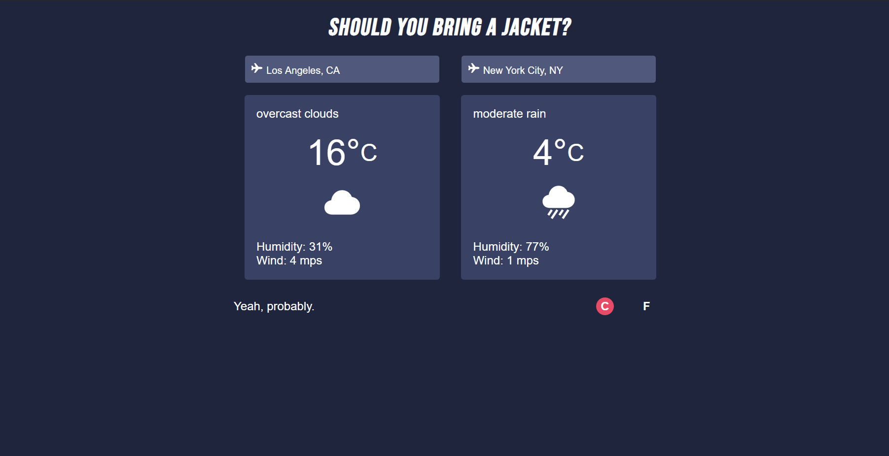

# Shoud You Bring a Jacket?

This is a This is a weather application that allows users to check out the current day's weather forecast for their departure city and their arrival city. The app compares the destination and arrival forecasts and suggests whether user should bring a jacket or not.

## Live Demo

[Try out the live demo of the project.](https://bring-a-jacket.herokuapp.com/)

## Built With

  - Bootstrapped with [Create React App](https://github.com/facebook/create-react-app)
  - [React](https://reactjs.org/) - Hooks (useState, useEffect)
  - [OpenWeatherMap API](https://openweathermap.org/) - Forecast data
  - [@jlalovi's Codepen](https://codepen.io/jlalovi/full/bIyAr) - Design of presentation