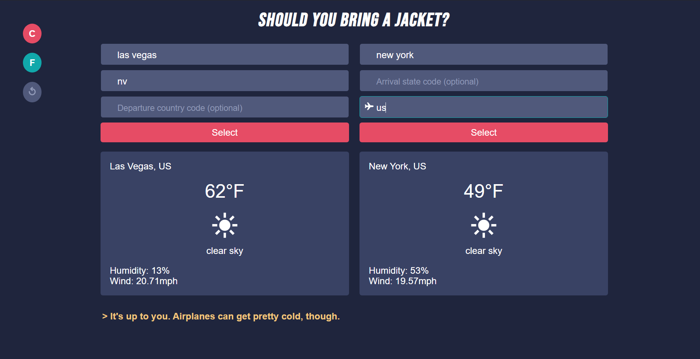

# Should You Bring a Jacket?
This is a weather application that allows users to check out the current day's weather forecast for their departure city and their arrival city. The app looks at the destination and suggests whether user should bring a jacket or not. The way it decides this leans more toward 'mom' and less 'complex non-Euclidean algorithm,' but this method has worked for most of human history.

  - Look up forecast, temperature, humidity, and wind speed information for chosen cities
  - Search bar features auto-completion for cities of the world
  - Toggle temperature results to display in either Celsius or Fahrenheit

## Live Demo

[Try out the live demo of the project.](https://bring-a-jacket.herokuapp.com/)

## Built With

  - HTML - Content structure
  - CSS - Custom properties, content presentation
  - JS - General functionality
  - [OpenWeatherMap API](https://openweathermap.org/) - Forecast data
  - [@jlalovi's Codepen](https://codepen.io/jlalovi/full/bIyAr) - Design of presentation